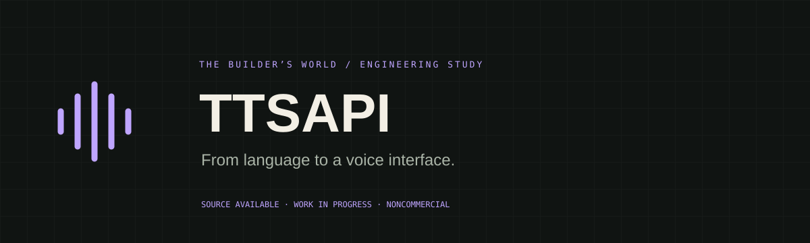
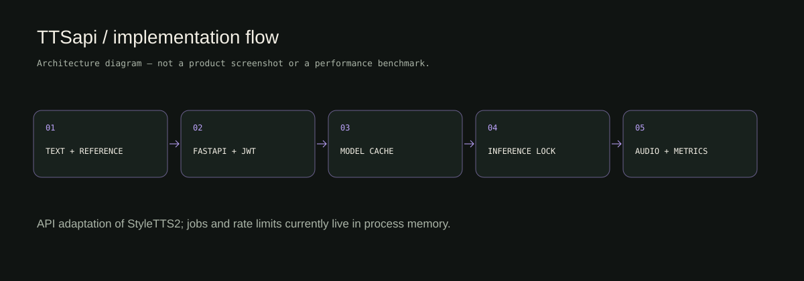
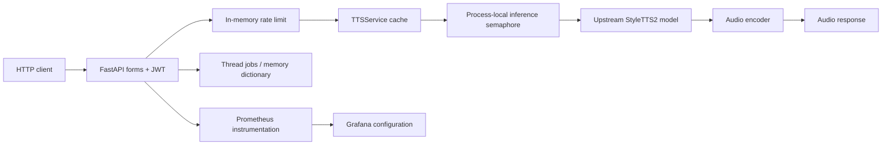
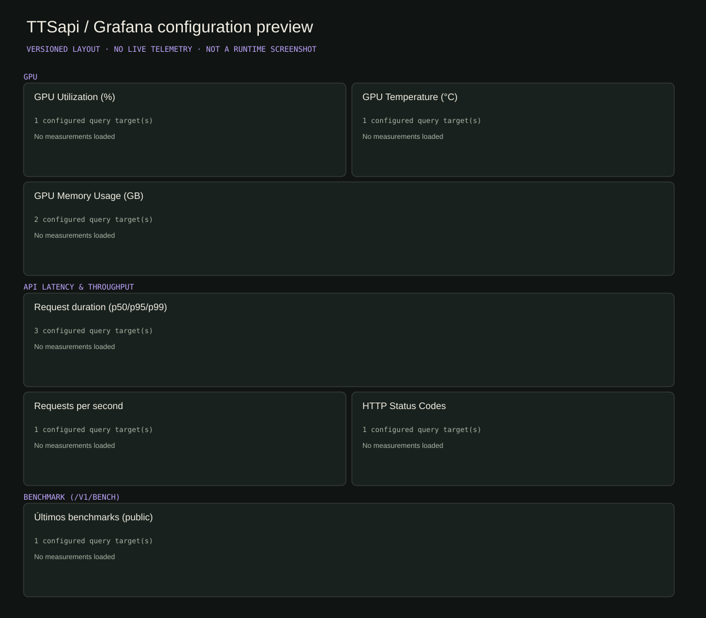

<p>     </p>

# TTSapi

**A FastAPI service layer around StyleTTS2 inference.**

This project adapts the upstream **StyleTTS2** model into an HTTP API with JWT authentication, model/style caches, serialized inference, audio-format conversion, ephemeral jobs, voice presets and observability. **Isaac’s contribution is the API/infrastructure layer, not the StyleTTS2 research model, training results or model weights.**

[Case study](https://isaacvaleriano.netlify.app/en/projects/ttsapi/) · [API reference](docs/API.md) · [Architecture](docs/ARCHITECTURE.md) · [Verification](docs/VERIFICATION.md) · [Roadmap](docs/ROADMAP.md) · [Português](README.pt-BR.md)

## What is implemented and inspectable

| Evidence | Result | Source |
|---|---:|---|
| Explicit application routes | **9 method/path pairs** | [api_server.py](api_server.py); [surface verifier](scripts/verify_api_surface.py) |
| Output formats | **WAV / MP3 / FLAC / OGG** | Service encoder; MP3/OGG require FFmpeg |
| Model identifiers | **LJSpeech / LibriTTS** | Upstream models, with separately supplied weights |
| Grafana visualization panels | **7 (plus 3 section rows)** | [versioned dashboard JSON](grafana/dashboards/styletts2_api.json) |
| Inference concurrency | **Semaphore(1)** | Serializes inference within one process |

These numbers describe the code/configuration. A static verifier was run, **not neural inference, quality scoring or latency benchmarking**. CPU/GPU support is conditional on PyTorch and the installed model dependencies. No GPU performance numbers are asserted.

## Architecture





Model bundles are cached by model/device. Reference audio is converted to mono; style presets are local files. `torch.inference_mode()` and optional CUDA mixed precision reduce inference overhead. These implementation choices must still be measured on target hardware.

Jobs currently run in daemon threads and live in an in-memory dictionary. **There is no durable queue and no implemented job-status/result retrieval endpoint.** An async function wrapping synchronous inference does not make its work nonblocking; a production worker boundary remains on the roadmap.

## Dashboard configuration



**Configuration preview, not a runtime screenshot.** The image is derived from panel titles, grid positions and queries in the actual dashboard JSON. It displays no fabricated time series, traffic or GPU measurements. Provisioning config covers GPU utilization/temperature/memory, request duration, requests/second, HTTP statuses and a benchmark table. Verify exported metric names and data-source wiring in your own runtime.

The benchmark table calls an inference endpoint: refreshing it can trigger compute work. Restrict or disable the public benchmark endpoint before exposing a service.

## Run locally

The GPU-oriented Compose file expects an NVIDIA-compatible Docker runtime. It is not a turnkey CPU/macOS deployment. You need model configurations/checkpoints, upstream prerequisites (including espeak-ng, libsndfile and FFmpeg) and a compatible PyTorch installation.

```bash
git clone https://github.com/yMScorpion/TTSapi.git
cd TTSapi
# Lightweight verification: no model, GPU, API key or inference needed
python3 scripts/verify_api_surface.py

# Full runtime setup (read prerequisites first)
python3 -m venv .venv
source .venv/bin/activate
pip install -r requirements.txt
# Supply Models/LJSpeech or Models/LibriTTS config.yml and checkpoints.
# See scripts/download_models.py and the archived upstream instructions.
export JWT_SECRET="$(python3 -c 'import secrets; print(secrets.token_urlsafe(48))')"
export AUTH_USERNAME="local-reviewer"
read -s -p 'Local API password: ' AUTH_PASSWORD; export AUTH_PASSWORD
uvicorn api_server:app --host 127.0.0.1 --port 8000
```

Open `/docs` on the local service for generated OpenAPI. [Getting started](docs/GETTING_STARTED.md) documents GPU Compose, permissions and model paths; [API reference](docs/API.md) describes endpoints and limitations. The default credentials in existing code/config are development placeholders and **must be replaced**.

## Roadmap

- [x] HTTP synthesis, JWT bearer dependency and four-format output.
- [x] Device/model/style caching and process-local inference serialization.
- [x] Voice preset CRUD and ephemeral job submission.
- [x] Prometheus/GPU metric definitions and Grafana provisioning files.
- [x] Documented API surface and a reproducible, model-free static verifier.
- [ ] Add bounded workers, durable job state, result/status endpoints and cancellation.
- [ ] Enforce token expiry/claims, upload/text/parameter limits and safe voice paths.
- [ ] Disable/protect public benchmark compute; validate rate limits in multi-worker mode.
- [ ] Add HTTP integration tests and restart/concurrency scenarios with a fake inference backend.
- [ ] Pin runtime dependencies and validate CPU/GPU installation matrices.
- [ ] Run reproducible inference/quality benchmarks with hardware, audio samples and methodology.

[Detailed roadmap](docs/ROADMAP.md).

## Attribution and licensing

StyleTTS2 was developed by **Yinghao Aaron Li, Cong Han, Vinay S. Raghavan, Gavin Mischler and Nima Mesgarani**. [Original repository](https://github.com/yl4579/StyleTTS2) · [Research paper](https://arxiv.org/abs/2306.07691) · [Archived upstream README](docs/STYLE_TTS2_UPSTREAM_README.md).

The original upstream code remains under **[MIT](LICENSE)**. Isaac’s original API/infrastructure additions and new project-specific documentation/artwork use **[PolyForm Noncommercial 1.0.0](LICENSE-API)**. See the exact [scope and third-party exclusions](docs/LICENSING.md). Model weights, datasets, reference voices and dependencies have separate terms. Earlier MIT grants remain valid; this repository must not be presented as wholly relicensed.

Built by [Isaac Valeriano](https://github.com/yMScorpion). Behind every line of code, there is a builder.
