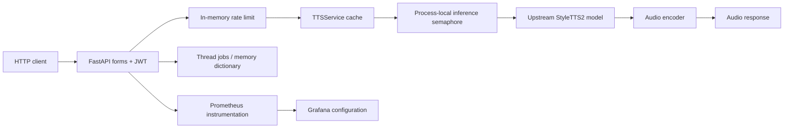

# TTSapi architecture

Model bundles are cached by model/device. Reference audio is converted to mono; style presets are local files. `torch.inference_mode()` and optional CUDA mixed precision reduce inference overhead. These implementation choices must still be measured on target hardware.

Jobs currently run in daemon threads and live in an in-memory dictionary. **There is no durable queue and no implemented job-status/result retrieval endpoint.** An async function wrapping synchronous inference does not make its work nonblocking; a production worker boundary remains on the roadmap.

## Verification boundary

The implementation diagram describes inspected source paths. It is not a screenshot, a production deployment claim or a measured latency/throughput result. See [verification](VERIFICATION.md) and [roadmap](ROADMAP.md).
